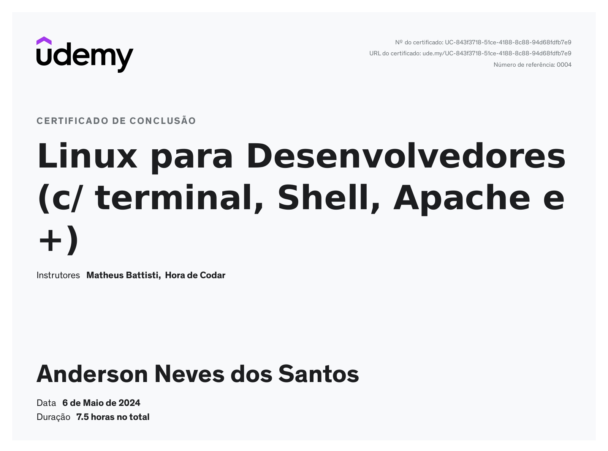
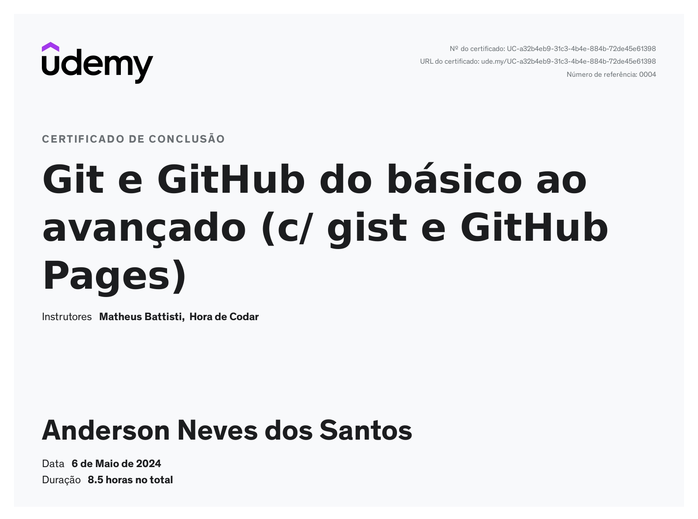

# 🏆 Certificados

## 📜 Certificado do Curso Linux para Desenvolvedores
- Aprendi sobre terminal, Shell, Apache e muito mais.

## 📜 Certificado Git e GitHub do básico ao avançado
- Cobertura completa de Git, Gist e GitHub Pages.

