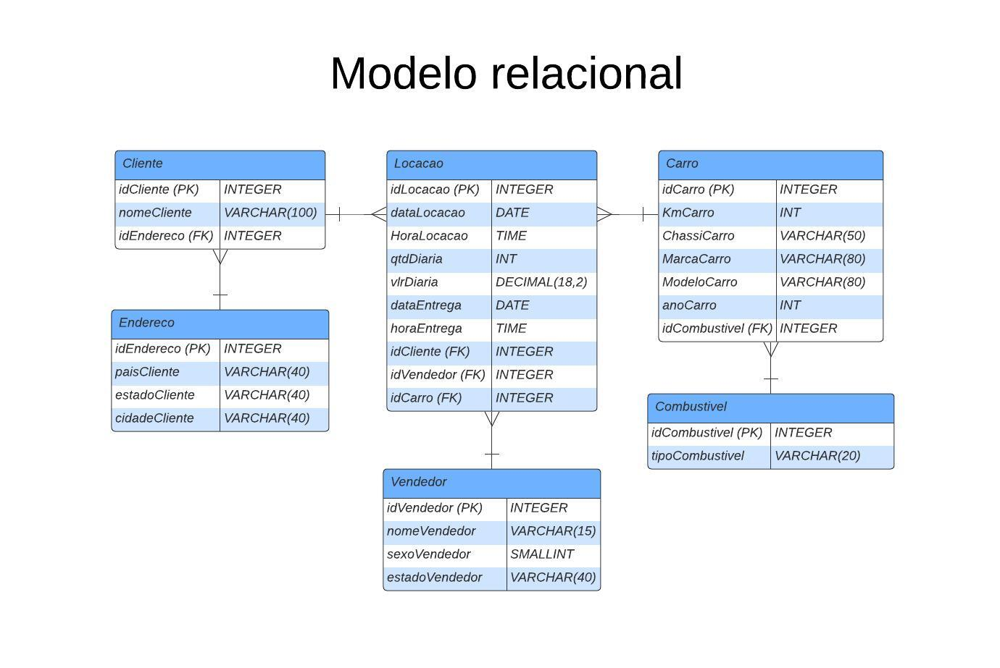
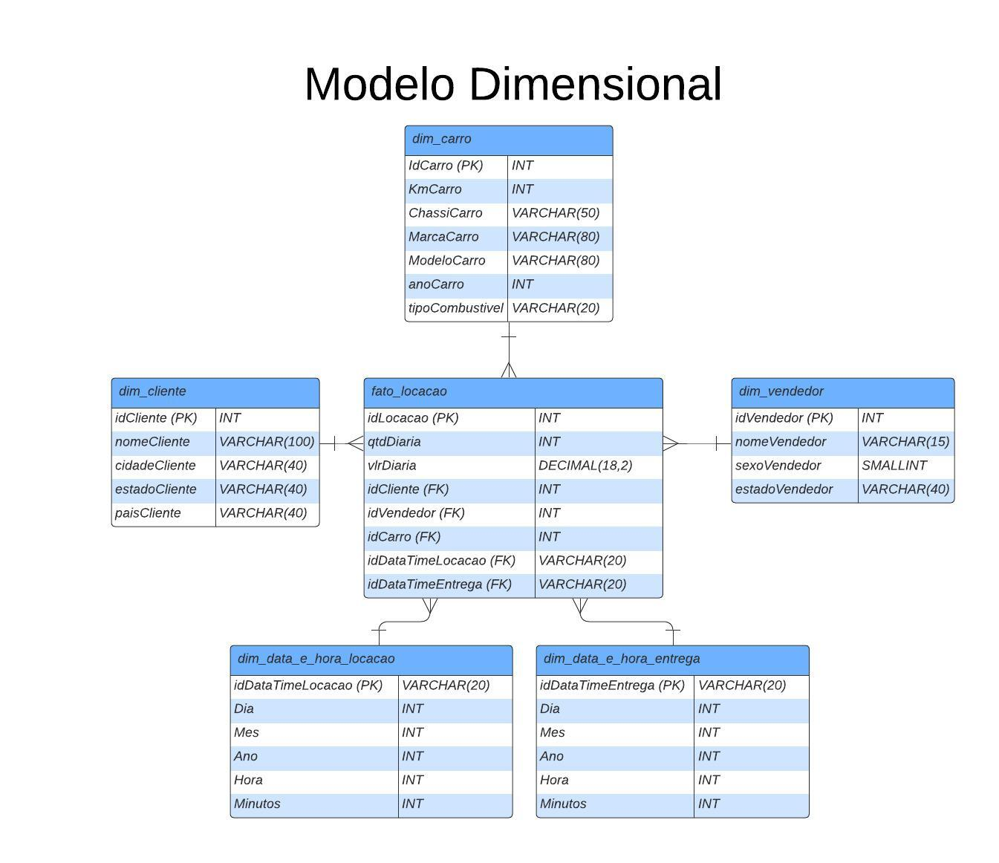

# 📋 Etapas

## 1️⃣ Criação do Modelo Relacional
- Primeiramente, foi normalizada a tabela `tb_locacao` para um modelo relacional.
  

    
  

## 2️⃣ Criação do Modelo Dimensional a partir do Relacional
- Em seguida, foi criado o modelo dimensional a partir do relacional no esquema estrela. Foram criadas dimensões importantes e mescladas algumas tabelas, além da criação da tabela fato.
  

    
  

  
## 3️⃣ Criação do Script SQL `ModeloRelacional.sql`
- Este script, ao ser executado, gera as tabelas e atributos correspondentes ao modelo relacional.
  [Modelo Relacional SQL](ETAPA-II/ModeloRelacional.sql)

## 4️⃣ Criação do Script SQL `InsecaoDosDados.sql`
- Este script, ao ser executado, mescla alguns dados repetidos na tabela `tb_locacao`, como `tipoCombustivel`, `cidade`, `carros`, etc., e adiciona na tabela correspondente. Além disso, todas as informações contidas em `tb_locacao` são migradas para a nova tabela relacional, preservando os dados.
  
  ⚠️ **Obs.:** Este script só pode ser executado dentro da conexão com o banco `concessionaria.sqlite`.
  [Inserção dos Dados SQL](ETAPA-II/InsecaoDosDados.sql)

## 5️⃣ Criação do Script SQL `ModeloDimensional.sql`
- Ao executar o script, serão criadas *views* das tabelas dimensões e a tabela fato, conforme mostrado no modelo dimensional. Essas *views* serão criadas a partir do modelo relacional.
  [Modelo Dimensional SQL](ETAPA-III/ModeloDimensional.sql)

## 6️⃣ Criação do Script `Normalizando_ER_e_Dimensional.sql`
- Este script gera as tabelas do modelo relacional e as *views* do modelo dimensional, tudo em um único script.
  [Normalizando ER e Dimensional SQL](ETAPA-III/Normalizando_ER_e_Dimencional.sql)

## 7️⃣ Criação do Script `Normalizando_e_Inserindo_dados_tb_locacao.sql`
- Este script gera as tabelas do modelo relacional, insere os dados de `tb_locacao` e gera as *views* do modelo dimensional, tudo em um único script.
  
  ⚠️ **Obs.:** Este script só pode ser executado dentro da conexão com o banco `concessionaria.sqlite`.
  [Normalizando e Inserindo Dados SQL](ETAPA-III/Normalizando_e_Inserindo_dados_tb_locacao.sql)
