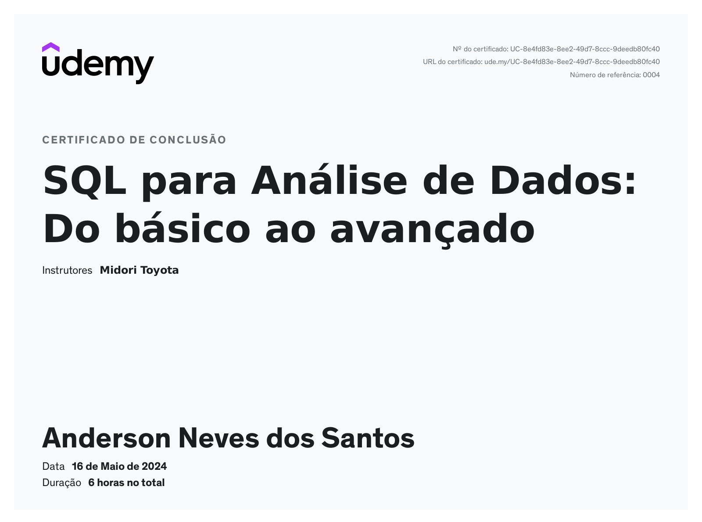

# 📝 Exercícios

## 1️⃣ Exportar o resultado da query que obtém os 10 livros mais caros para um arquivo CSV
- Foi solicitado que nessa exportação se utilizasse o caractere `;` (ponto e vírgula) como separador, e que o conteúdo do arquivo tivesse as seguintes colunas, respectivamente: CodLivro, Titulo, CodAutor, NomeAutor, Valor, CodEditora e NomeEditora.
  

## 2️⃣ Exportar o resultado da query das 5 editoras com maior quantidade de livros na biblioteca para um arquivo CSV
- Foi solicitado que nessa exportação se utilizasse o caractere `|` (pipe) como separador, e que o conteúdo do arquivo tivesse as seguintes colunas, respectivamente: CodEditora, NomeEditora, QuantidadeLivros.
  

# 🔍 Evidências

- Nenhuma

# 🏆 Certificados

## 📜 Certificado do Curso SQL para Análise de Dados: Do básico ao avançado
- Cobertura completa de SQL para análise de dados.

## 📜 Certificado AWS Partner: Sales Accreditation (Business) (Portuguese)
- Acreditação de vendas para parceiros AWS.

