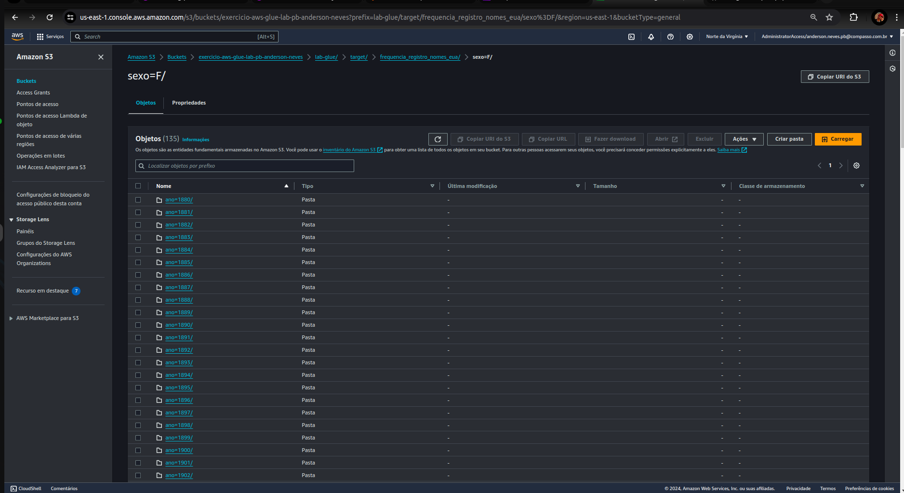
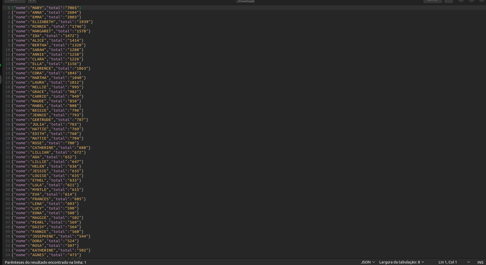

# Aprendizagens 

- Considerei essa sprint uma das que mais somou meus aprendizados no estágio até o momento, visto além de aprender sobre a ferramenta Spark e como ela é útil para criação e manipulação de dataFrames, também apredi na pŕatica acriação de um processo ETL e com outros conhecimentos adquiridos nas sprints anteriores consegui realizar o desafio proposto dessa sprint.

# 📝 Exercícios

## 1️⃣ Apache Spark - Contador de Palavras
### Exercicio proposto consiste no uso da imagem all-spark-notebook para contagem das palavras do meu readme.
- Etapa 1: Baixar a imagem jupyter/all-spark-notebook.
- Comando:
    ```
    docker pull jupter/all-spark-notebook
    ```
- Etapa 2: Criar container e rodar de forma interativa usando a imagem jupter/all-spark-notebook na porta 8888, nomeando o container `spark_jupyter` e removendo após execução  
    ```
    docker run -it --rm --name spark_jupyter -p 8888:8888 jupyter/all-spark-notebook
    ```
    
    

- Etapa 3: Iniciando uma sessão interativa do PySpark com o comando `pyspark` no container spark_jupyter utilizando comando docker `exec` e `-i -t` para rodar de forma interativa dentro do container.
    ```
    docker exec -i -t spark_jupyter pyspark
    ```
    
- Etapa 4: Em outro terminal fiz o dowload do meu README principal do diretório onde estão meus dados da compass. Gerei um token no meu github para consegui realizar dowload com `wget` e utilizei o comando `exec` para executar dentro do container docker.
    ```
    docker exec spark_jupyter wget -c --header="Authorization: token token_de_acesso" https://raw.githubusercontent.com/anderson-neves-dev/EstagioCompass/main/README.md
    ```
    
    

- Etapa 5: Realizando a contagem e palavras do arquivo README dentro da sessão PySpark
  - 
    ```python
    #Importando Biblioteca SparkSession
    from pyspark.sql import SparkSession
    # Iniciando uma sSparkSession
    spark = SparkSession.builder.appName("ContadorDePalavrasReadme").getOrCreate()
    spark_context = spark.sparkContext

    # Lendo o arquico README.md que está no container docker
    arquivo_readme = sc.textFile('README.md')

    # Testando para ver se conseguiu ler e imprimir a quantidade de linhas no arquivo
    print(arquivo_readme.count())

    # importando a biblioteca re
    import re

    # Extraindo das linhas todas as palavras 
    palavras = arquivo_readme.flatMap(lambda linha: re.split('\W+', linha.lower().strip()))

    # Mapeando o rdd para cada palavra adicionar a quantidade de 1 em outra coluna
    palavras = palavras.map(lambda palavra: (palavra,1))

    # Importando add
    from operator import add

    # Mesclando o rdd para contar a quantidade que cada palavra se repete
    palavras = palavras.reduceByKey(add)

    # Exibindo a coleção
    palavras.collect()

    # Filtrando apenas as palavras 
    palavras = palavras.filter(lambda palavra: palavra[0].strip() != '')

    # Ordenando de forma decrecente pela quantidade
    palavras_ordenadas = palavras.sortBy(lambda palavra: palavra[1], ascending=False)

    # Exibindo a coleção ordenada
    palavras_ordenadas.collect()

    # Criando um data frame com o schema de colunas
    palavras_ordenadas_df = spark.createDataFrame(palavras_ordenadas, ["Palavra", "Quantidade"])

    # Exportando o data frame com tipo parquet para dentro do container
    palavras_ordenadas_df.write.parquet("/home/jovyan/palavras_ordenadas_df.parquet")

    # Exibindo o Data Frame
    palavras_ordenadas_df.show()

    # Encerrando a sessão spark
    spark.stop()
    ```
- Evidências de execução dos comando acima
    
    
- Etapa 6: Resgatar os dados Parket no jupyter e criar um gráfico com matplotlib
    
    
    
    
- Copiei arquivo esSpark.ipynb de dentro do container spark_jupyter, com o comando:
  ```
  docker cp spark_jupyter:/home/jovyan/exSpark.ipynb ./trainee-repo-template/'Sprint 7'/Exercicios/all-spark-notebook/exSpark.ipynb
  ```
  

- Explicação do código no jupyter bem como os resutados em:  [Exercicios/all-spark-notebook/exSpark.ipynb](Exercicios/all-spark-notebook/exSpark.ipynb)

## 2️⃣ Lab AWS Glue

  ### O exercício proposto consiste na construção de um ETL (Extract, Transform and Load) de forma simplificada utilizando os serviços AWS Glue.
  #### Etapas:

 1. Preparando os dados de origem :
   - Armazenando o arquivo nomes.csv que foi enviado como recurso no bucket s3. Esse arquivo contém os registros de quantidade de cada nome por ano e sexo. 
  
2. Configurando conta para utilizar aws glue:
   - Criando usúario IAM com permissão _s3FullAcess_ 
    
3. Criando a IAM Role para os Jobs do AWS Glue
   
   
4. Criando data lake aws-glue
   
   
   
5. Criando um job no aws glue:
   
   
   
   
- Após o job criado e configurado criei o seguinte código em spark para atender as seguintes demandas do exercício:
  
- código com os devidos comentários onde resolvi cada etapa solicitada:
  ```python
    import sys
    from awsglue.transforms import *
    from awsglue.utils import getResolvedOptions
    from pyspark.context import SparkContext
    from awsglue.context import GlueContext
    from awsglue.job import Job
    from pyspark.sql.functions import col, upper, count, max

    ## @params: [JOB_NAME]
    args = getResolvedOptions(sys.argv, ['JOB_NAME', 'S3_INPUT_PATH', 'S3_TARGET_PATH'])
    sc = SparkContext()
    glueContext = GlueContext(sc)
    spark = glueContext.spark_session
    job = Job(glueContext)
    job.init(args['JOB_NAME'], args)

    source_file = args['S3_INPUT_PATH']
    target_path = args['S3_TARGET_PATH'] + '/frequencia_registro_nomes_eua'

    # Fazendo a leitura do arquivo csv nomes que está no meu bucket s3 passado na variavel de parametro S3_INPUT_PATH
    data_frame_com_arquivo_nomes = spark.read.option("header", True).option("sep", ",").csv(source_file)

    # Imprimo somente o schema  para ver as tipagens de cada coluna
    data_frame_com_arquivo_nomes.printSchema()

    # Convertendo para maiúculo os nomes que estão na coluna nomes
    data_frame_com_arquivo_nomes = data_frame_com_arquivo_nomes.withColumn("nome", upper(col("nome")))

    # Imprindo a contagem de linhas que o arquivo possui
    print(f"Total de linhas: {data_frame_com_arquivo_nomes.count()}")

    # Imprimindo a contagem de nomes, agrupando os dados pelas colunas ano e sexo, e ordenando pela coluna ano de forma decrescente para pegar os anos mais recentes
    contagem_dos_nomes = data_frame_com_arquivo_nomes.groupBy("ano", "sexo").count().orderBy(col("ano").desc())
    contagem_dos_nomes.show()

    # Ordenando o data frame principal de forma decrescente pela coluna ano 
    data_frame_com_arquivo_nomes = data_frame_com_arquivo_nomes.orderBy(col("ano").desc())

    # Imprindo o nome feminino com mais registros e o ano que ocorreu
    nome_feminino_com_mais_registros = data_frame_com_arquivo_nomes.filter(col("sexo") == "F").groupBy("nome", "ano").agg(max("total").alias("max_total")).orderBy(col("max_total").desc()).first()
    print(f"Nome feminino com mais registros: {nome_feminino_com_mais_registros['nome']} em {nome_feminino_com_mais_registros['ano']}")

    # Imprindo o nome masculino com mais registros e o ano que ocorreu
    nome_masculino_com_mais_registros = data_frame_com_arquivo_nomes.filter(col("sexo") == "M").groupBy("nome", "ano").agg(max("total").alias("max_total")).orderBy(col("max_total").desc()).first()
    print(f"Nome masculino com mais registros: {nome_masculino_com_mais_registros['nome']} em {nome_masculino_com_mais_registros['ano']}")

    # Imprimindo o agrupamento do total de registros masculinos e femininos para cada ano
    total_registros_por_ano = data_frame_com_arquivo_nomes.groupBy("ano").agg(count("nome").alias("total_registros"))
    total_registros_por_ano.show()

    # Extraindo apenas as 10 primeras linhas ordenadas pelo ano de forma crescente
    filtragem_primeiras_10_linhas = data_frame_com_arquivo_nomes.orderBy(col("ano").asc()).limit(10)
    filtragem_primeiras_10_linhas.show()

    # Exportando em formato json os conteúdos do dataframe com o particionamentona ordem sexo e ano para o diretorio target no meu bucket s3 
    data_frame_com_arquivo_nomes.write.partitionBy("sexo", "ano").json(target_path)

    job.commit()
  ```
  - Código completo disponivel em: 
  - Evidência do código na aws:
  
  - ## Uma das partes que mais tive dificuldade foi a de imprimir o nome feminino e masculino com mais registros. Pois tive fazer um junção das funções: `filter` `groupBy` `agg` `max` `alias` `desc` e `first`.
    - `.filter`: Filtrar os dados para incluir apenas os registros do sexo que queria;
    - `.groupBy`: Agrupar os meus dados por nome e ano;
    - `agg(max("total").alias("max_total"))`: Calcular o máximo de registros para cada nome e ano, adicionando uma nova coluna ao data frame;
    - `orderBy`: Para conseguir ordenar os dados pela coluna max_total que criei.
    - `first`: Por fim, pegar apenas a primeira linha que deve ser a que contém o nome que contém mais registros.

- Evidências de execução:
  
  - CloudWatch continuous logs:
  
  
  - Percebi que não tinha ordenado a coluna para o ano mais recente então refatorei o código e rodei novamente o job (os códigos mostrados acima já estão corrigidos)
  
  - Diretórios criados no bucket
  
  
  
  
  - Arquivos json gerados
  
  
  
6. Criando novo crawler:
   
   
   
   
- Executando o crawler:
  

7. Testando o banco de dados aws-glue criado com o crawler
   - Contagem do total de linhas:
    
    - Contagem de nomes agrupados por sexo e por ano, exibindo na ordem dos anos mais recentes:
    
    - Nome feminino e ano com mais registros:
    
    - Nome masculino e ano com mais registros:
    
    - Total de registros (masculino e feminino) para cada ano ordenado pelo ano de forma crescente:
    

    ## Exercício finalizado com muita aprendizagem adquirida na prática do processo de criação de um ETL com os serviços da aws.


