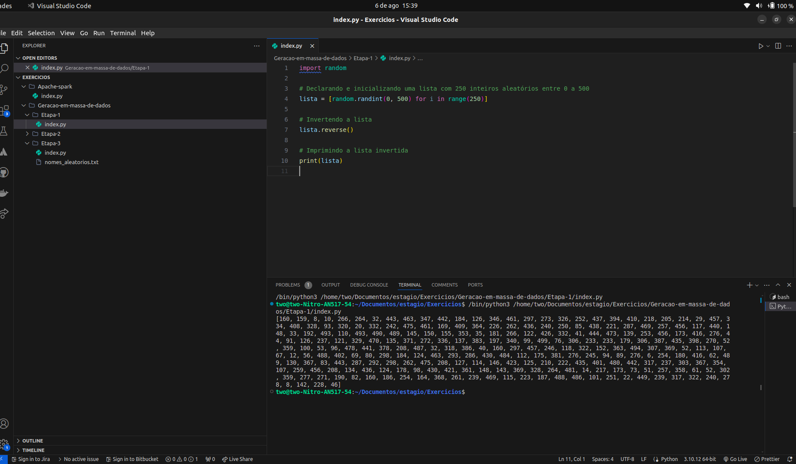
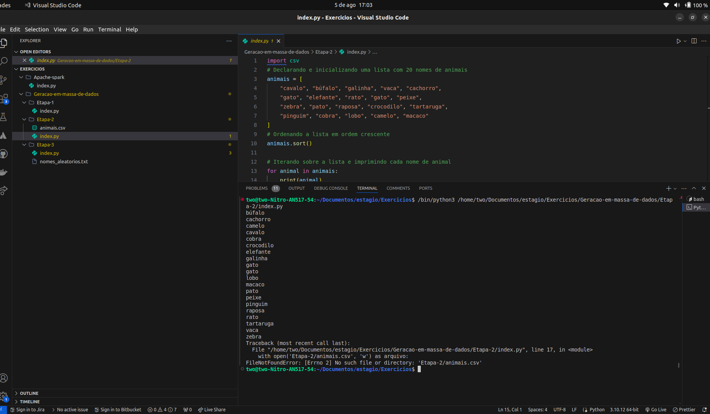
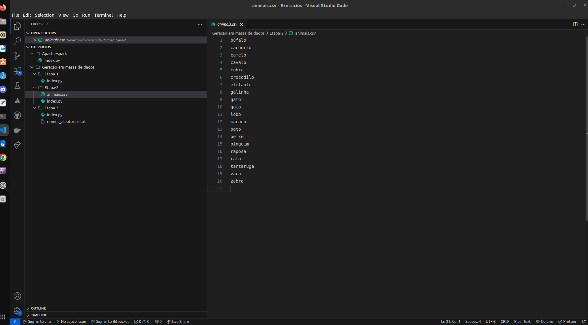
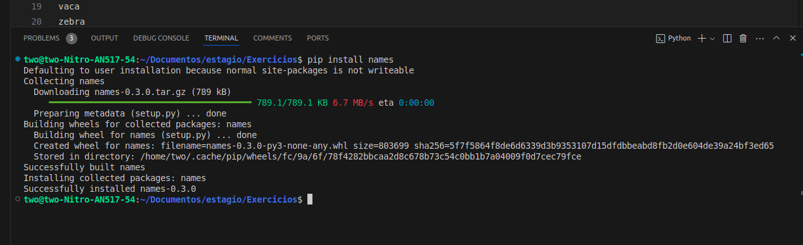
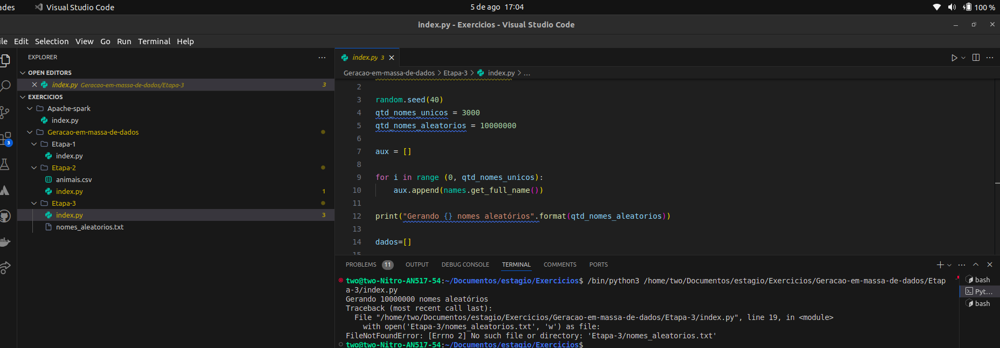
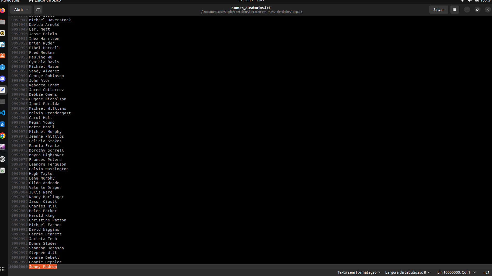
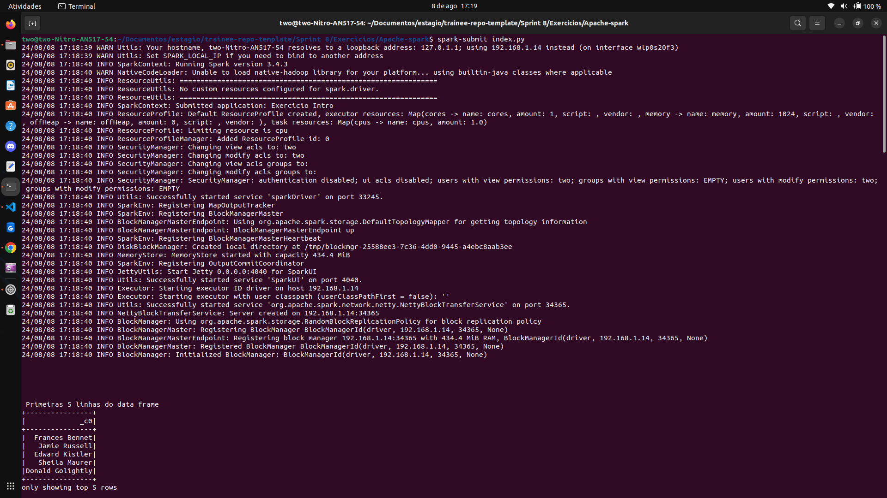
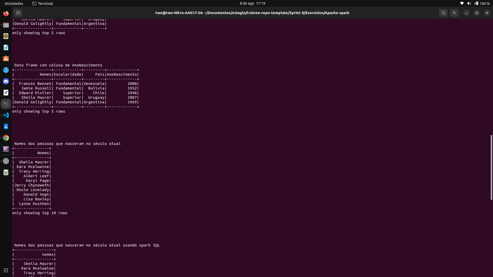
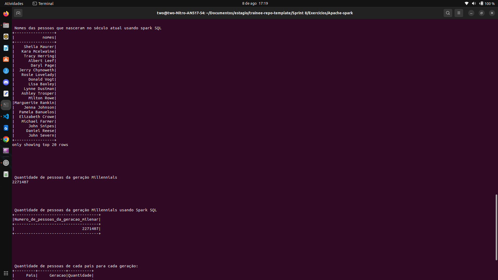

# 📝 Exercícios

## 1️⃣ Geração em massa de dados
### Exercício 3.1 
- O exercício proposto consiste em declarar e iniciar uma lista contendo 250 inteiros obtidos de forma aleatória. Após isso, deve ser aplicado o método reverse no conteúdo da lista e imprimir o resultado
- Código em python com os devidos comentários:
    ```python
    import random

    # Declarando e inicializando uma lista com 250 inteiros aleatórios entre 0 a 500
    lista = [random.randint(0, 500) for i in range(250)]

    # Invertendo a lista
    lista.reverse()

    # Imprimindo a lista invertida
    print(lista)
    ```
- **Código completo em:** [Exercicios/Geracao-em-massa-de-dados/Etapa-1/index.py](Exercicios/Geracao-em-massa-de-dados/Etapa-1/index.py)
- Evidência de execução:

  
### Exercício 3.2
- Nesse exercício foi proposto que fizesse um código em python que declarasse e inicializa-se uma lista contendo o nome de 20 animais, ordena-se essa linha em ordem crescente e itere sobre os itens imprimindo um a um e na sequência gravar a lista em um aquivo no formato CSV.
- Código com os devidos comentários de cada parte:
    ```python
    import csv
    # Declarando e inicializando uma lista com 20 nomes de animais
    animais = [
        "cavalo", "búfalo", "galinha", "vaca", "cachorro",
        "gato", "elefante", "rato", "gato", "peixe",
        "zebra", "pato", "raposa", "crocodilo", "tartaruga",
        "pinguim", "cobra", "lobo", "camelo", "macaco"
    ]
    # Ordenando a lista em ordem crescente
    animais.sort()

    # Iterando sobre a lista e imprimindo cada nome de animal
    for animal in animais:
        print(animal)

    # Armazenando o conteúdo da lista em um arquivo CSV
    with open('Etapa-2/animais.csv', 'w') as arquivo:
        escritor = csv.writer(arquivo)
        for animal in animais:
            escritor.writerow([animal])

    ```
- **Código completo em:** [Exercicios/Geracao-em-massa-de-dados/Etapa-2/index.py](Exercicios/Geracao-em-massa-de-dados/Etapa-2/index.py)
- Evidências de execução:
  
- Arquivo csv gerado: 
  
  - Arquivo csv disponível em: [Exercicios/Geracao-em-massa-de-dados/Etapa-2/animais.csv](Exercicios/Geracao-em-massa-de-dados/Etapa-2/animais.csv)
### Exercício 3.3
- Esse exercício consiste em elaborar um código python para gerar um dataset com 10 milhões de nomes de pessoas.
1. Instalar a biblioteca names para gerar nomes aleatórios com o comando `pip install names`
- Evidência: 
  
2. Importar as bibliotecas `random`, `time`, `os` e `names`
   ```
   import random, time, os, names
   ```
3. Definir os parâmetros para geração dos nomes no dataset
   ```
    random.seed(40)
    qtd_nomes_unicos = 3000
    qtd_nomes_aleatorios = 10000000
   ```
4. Gerar os nomes aleatórios
    ```python
    aux = []

    for i in range (0, qtd_nomes_unicos):
        aux.append(names.get_full_name())

    print("Gerando {} nomes aleatórios".format(qtd_nomes_aleatorios))

    dados=[]

    for i in range(0, qtd_nomes_aleatorios):
        dados.append(random.choice(aux))
    ```
- **Código completo em:** [Exercicios/Geracao-em-massa-de-dados/Etapa-3/index.py](Exercicios/Geracao-em-massa-de-dados/Etapa-3/index.py)
5. Gerar um arquivo de texto com o nome nomes_aleatorios.txt e salvar cada nome em cada linha.
- Evidências de execução:
  
- Arquivo txt gerado e aberto no editor de texto mostrando a última linha:
  
- Obs.: Coloquei o arquivo nomes_aleatórios.txt no .gitignore

## 2️⃣ Apache Spark

  ### O exercício proposto consiste na prática de manipulação de dataframes utilizando o Apache Spark.

  #### Etapas:

- **Etapa 1**. Importando as bibliotecas que serão utilizadas, inicializando a spark Session e definindo um Context para habilitar o módulo SQL

    ```python
    from pyspark.sql import SparkSession
    from pyspark import SparkContext, SQLContext, SparkConf
    from pyspark.sql.functions import when, rand, col, floor
    from pyspark.sql.types import IntegerType
    ```
- Configurei o Spark Session com SparkConf para não exibir os dados de log do código e dessa forma melhorar a exibição da compilação dos dados. 
    ```python
    spark_configuracao = SparkConf().set("spark.eventLog.enabled", "false")

    # Cria a SparkSession
    spark = SparkSession \
        .builder \
        .master("local[*]") \
        .appName("Exercicio Intro") \
        .config(conf=spark_configuracao)\
        .getOrCreate()

    # Ajusta o nível de log para aprecer somente os logs WARN 
    spark.sparkContext.setLogLevel("WARN")
    ```
- Lendo o arquivo txt nomes_aleatorios.txt gerados no último exercício e carregando para dentro de um dataframe. Após isso, exibir as 5 primeiras linhas do dataframe.
    ```python
    # Lendo o arquivo txt e transformando em um dataFrame
    df_nomes = spark.read.csv("nomes_aleatorios.txt")
    print("\n\n\n\n\n Primeiras 5 linhas do data frame")
    df_nomes.show(5)
    ```
- **Etapa 2.** Renomeando a coluna nomes do dataframe para Nomes
    ```python
    print("\n\n\n\n\n Esquema do data frame após o renomeio da coluna para Nomes")
    # Renomeando a coluna para Nomes
    df_nomes = df_nomes.withColumnRenamed("_c0", "Nomes")
    df_nomes.printSchema()
    ```
- **Etapa 3.**  Adicionando a coluna Escolaridade e atribuindo cada linha de forma aleatória.
- Para isso utilizei a função `.withColumn` para criar uma nova coluna e para cada linha é gerado um número aleatório usando a função `rand()` que gera valores aleatórios entre 0 e 1, e como tenho 3 casos de escolaridade então `1/3 = 0.33`, ou seja, tenho três possiveis casos usando meu rand para escrever em cada linha. Para as possibilidades nos `when` tenho: se o número for entre 0 a 0.33 a linha será preenchida com o 'Fundamental', se for entre 0.33 e 0.66 será preenchida com o 'Medio' e para outras possibilidades (`otherwise`) 'Superior'.
    ```python 
    #Criando a columa de Escolaridade com valores aleatorios
    df_nomes = df_nomes.withColumn(
        "Escolaridade",
        when(rand() < 0.33, "Fundamental")
        .when((rand() >= 0.33) & (rand() < 0.66), "Medio")
        .otherwise("Superior")
    )
    print("\n\n\n\n\n Data frame com coluna de Escolaridade")
    df_nomes.show(5)
    ```
- **Etapa 4.**  Adicionando a coluna País
- Utilizando a mesma lógica acima criei a coluna País que contém 13 países da América do Sul, só que como tenho 13 valores, logo `1/13 = 0.077`. Então continuei com os possíveis 13 intevalos de casos de geração de números aleatórios com `rand()` para cada país em cada linha.
    ```python
    #Criando a columa de Pais com valores aleatorios
    df_nomes = df_nomes.withColumn(
        "Pais",
        when(rand() < 0.07, "Brasil")
        .when((rand() >= 0.07) & (rand() < 0.15), "Argentina")
        .when((rand() >= 0.15) & (rand() < 0.23), "Bolivia")
        .when((rand() >= 0.23) & (rand() < 0.30), "Peru")
        .when((rand() >= 0.30) & (rand() < 0.38), "Uruguay")
        .when((rand() >= 0.38) & (rand() < 0.46), "Chile")
        .when((rand() >= 0.46) & (rand() < 0.53), "Venezuela")
        .when((rand() >= 0.53) & (rand() < 0.61), "Colombia")
        .when((rand() >= 0.61) & (rand() < 0.69), "Paraguai")
        .when((rand() >= 0.69) & (rand() < 0.76), "Equador")
        .when((rand() >= 0.76) & (rand() < 0.84), "Suriname")
        .when((rand() >= 0.84) & (rand() < 0.92), "Guiana")
        .otherwise("Guiana Francesa")
    )

    print("\n\n\n\n\n Data frame com coluna de Pais")
    df_nomes.show(5)
    ```

- **Etapa 5.**  Adicionando coluna AnoNascimento com valores aleatórios entre 1945 e 2010
- Para gerar os valores aleatórios de ano em cada linha no intervalo de ano de 1945 a 2010 com a seguinte lógica:
  - A função `rand()` gera valores aleatórios entre 0 e 1
  - Com o resultado entre 0 e 1, será multiplicado pela soma de `2010 - 1945 + 1` correspondente ao valor de intervalo entre esses anos (no caso 66 anos). Então, se multiplicarmos qualquer valor de 0 a 1 por 66 o resultado vai dar um número com parte inteira que somado com 1945 vai resultar em um ano corresponde ao intervalo desejado.
  - Ex: `0.55 * 66 = 36,3 => floor(36,3) = 36 => 36 + 1945 = 1981`
  - Por fim, converto cada linha da coluna para o tipo inteiro.
    ```python
    df_nomes = df_nomes.withColumn(
        "AnoNascimento",
        (floor(rand() * (2010 - 1945 + 1)) + 1945).cast(IntegerType())
    )

    print("\n\n\n\n\n Data frame com coluna de AnoNascimento")
    df_nomes.show(5)
    ```

- **Etapa 6.**  Selecionando apenas os nomes das pessoas que nasceram no século atual
- Utilizei a função `.filter()` para filtrar apenas as linhas da coluna AnoNascimento maiores ou iguais a 2001 e utilizei `.select()` para exibir apenas os nomes.
    ```python
    # Selecionando apenas os nomes das pessoas que nasceram no século atual
    df_select =  df_nomes.select("Nomes").filter((col("AnoNascimento") >= 2001))
    print("\n\n\n\n\n Nomes das pessoas que nasceram no século atual")
    df_select.show(10)
    ```
- **Etapa 7.**  Realizando a consulta anterior com Spark SQL
    ```python
    # Registrando uma tabela temporária com o nomes Pessoas
    df_nomes.createOrReplaceTempView("Pessoas")

    print("\n\n\n\n\n Nomes das pessoas que nasceram no século atual usando spark SQL")

    # Selecionando apenas os nomes das pessoas que nasceram no século atual com Spark SQL
    spark.sql("select nomes from pessoas where AnoNascimento >= 2001").show()
    ```
- **Etapa 8.**  Contagem dos nomes das pessoas do século Millennials

    ```python
    # Selecionando e realizando a contagem apenas os nomes das pessoas do século Millennials
    print("\n\n\n\n\n Quantidade de pessoas da geração Millennials")
    df_millennials = df_nomes.filter((col("AnoNascimento") >= 1980) & (col("AnoNascimento") <= 1994))

    print(df_millennials.count())
    ```

- **Etapa 9.**  Realizando a consulta anterior com Spark SQL
    ```python
    print("\n\n\n\n\n Quantidade de pessoas da geração Millennials usando Spark SQL")

    # Selecionando apenas os nomes das pessoas do século Millennials com Spark SQL
    spark.sql("select count(*) as Numero_de_pessoas_da_geracao_milenar from pessoas where AnoNascimento BETWEEN 1980 and 1994").show()
    ```
- **Etapa 10.**  Quantidade de pessoas de cada país para cada geração com o uso de Spark SQL
    
- Essa foi uma das consultas que mais me desafio no exercício, pois tive que usar diversas operações de consultas e sub consultas.
- Primeiramente, tive que realizar uma sub consulta para gerar a coluna geração, utilizei a função condicional WHEN do sql para nomear cada linha de cada geração, pelo intervalo de ano de nascimento que corresponde. Logo em seguida, tive que nomear essa sub consulta para não dar erros de ambiguidade.
    ```sql
        SELECT 
            Pais,
            CASE
                WHEN AnoNascimento BETWEEN 1944 AND 1964 THEN 'Baby Boomers'
                WHEN AnoNascimento BETWEEN 1965 AND 1979 THEN 'Geração X'
                WHEN AnoNascimento BETWEEN 1980 AND 1994 THEN 'Millennials'
                WHEN AnoNascimento BETWEEN 1995 AND 2015 THEN 'Geração Z'
            END AS Geracao
        FROM Pessoas
        AS tabelaComColunaGeracao
    ```

- Após isso, realizei um consulta de país, geração e a quantidade de gerações na sub consulta `tabelaComColunaGeracao`, agrupando pelas colunas país e geração.
- Por fim, adicionei o resultado da consulta em um dataframe e depois ordenei usando a função `.orderBy()` primeiramente pelo Pais, segundamente por geração e por fim, quantidade de cada geração.
    ```python
    df_result = spark.sql("""
        SELECT 
            Pais, 
            Geracao, 
            COUNT(*) as Quantidade
        FROM 
            (
                SELECT 
                    Pais,
                    CASE
                        WHEN AnoNascimento BETWEEN 1944 AND 1964 THEN 'Baby Boomers'
                        WHEN AnoNascimento BETWEEN 1965 AND 1979 THEN 'Geração X'
                        WHEN AnoNascimento BETWEEN 1980 AND 1994 THEN 'Millennials'
                        WHEN AnoNascimento BETWEEN 1995 AND 2015 THEN 'Geração Z'
                    END AS Geracao
                FROM Pessoas
            ) AS tabelaComColunaGeracao
        GROUP BY 
            Pais, Geracao
    """)

    # Ordenando o DataFrame pelos campos Pais, Geracao e Quantidade
    df_ordered_result = df_result.orderBy("Pais", "Geracao", "Quantidade")
    print("\n\n\n\n\n Quantidade de pessoas de cada país para cada geração:")
    df_ordered_result.show(10)
    ```
- **Script pyspark completo em:** [Exercicios/Apache-spark/index.py](Exercicios/Apache-spark/index.py)
- Para compilar o script utilizei a comando `spark-submit`
- Evidências de copilação do script:
    
    
    
    
    


 ## Exercícios finalizados com muita aprendizado adquirido na prática de manipulação de dataframes com Apache Spark.

