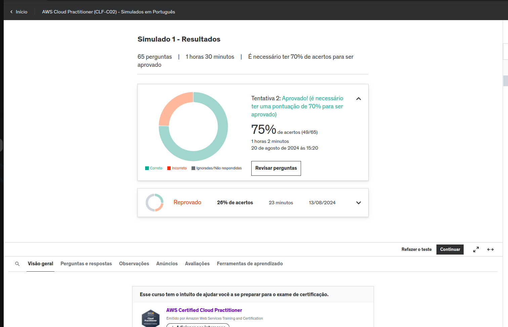
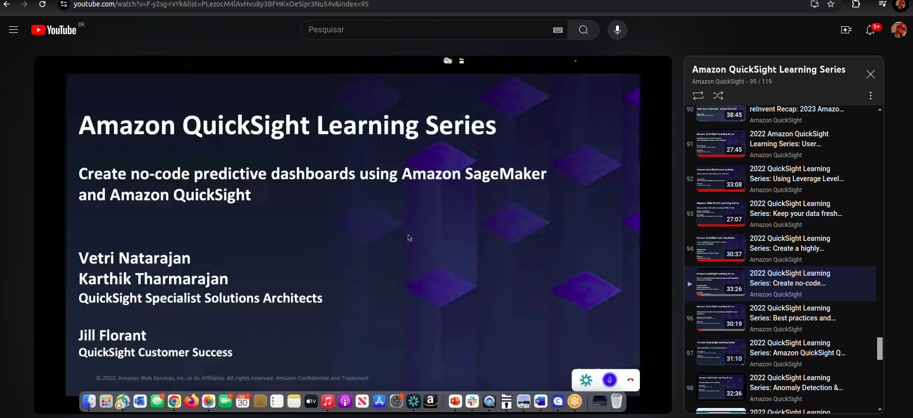

### Essa sprint não conteve nenhum execício, além do desafio que foi a entrega da quarta etapa do desafio final. Mas realizei vários simulados para a prova de certificação da AWS contidos no conteúdo complementar da trilha de apredizado do pb que foi o de: Amazon AWS Certified Cloud Practitioner - AWS Certified Cloud Practitioner (CLF-C01) Exam. Além do simulado que busquei indicão externa na udemy: AWS Cloud Practitioner (CLF-C02) - Simulados em Português, em que esse mostra o resultado.

### Além dos simulados fiz estudos sobre o serviço Amazon QuickSight com o curso no Youtubee Amazon QuickSight Learning Series.
