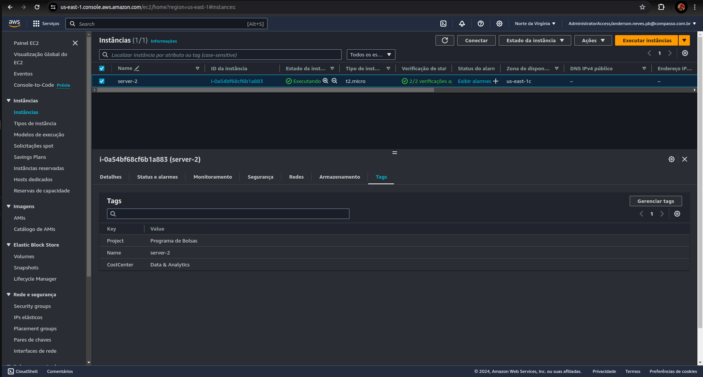
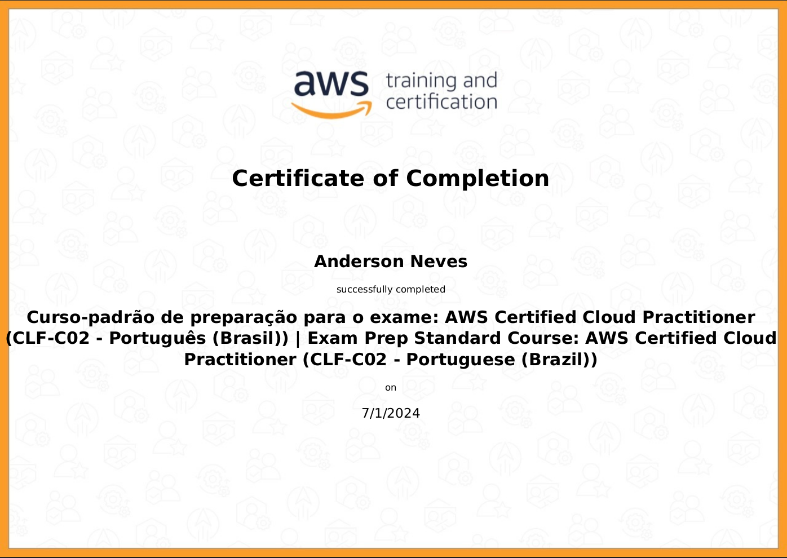

# 📝 Exercício

## 1️⃣ Criação da instância EC2 na aws

# 🔍 Evidências

# 🏆 Certificados
- Curso-padrão de preparação para o exame: AWS Certified Cloud Practitioner
(CLF-C02 - Português (Brasil)).

- [AWS Cloud Quest: Cloud Practitioner](https://www.credly.com/badges/70ad9b6e-06da-4507-ae1d-fb6313aa5258/public_url)
