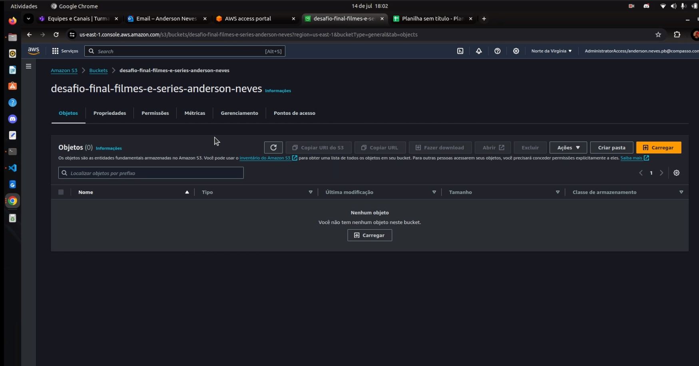
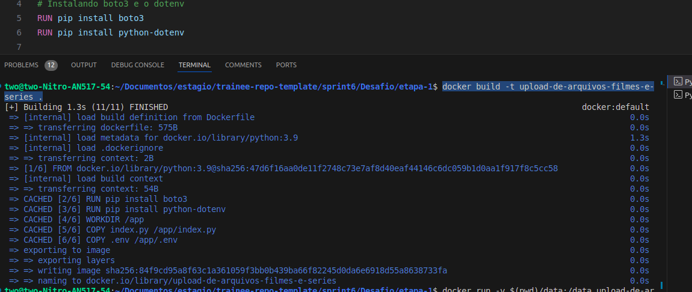
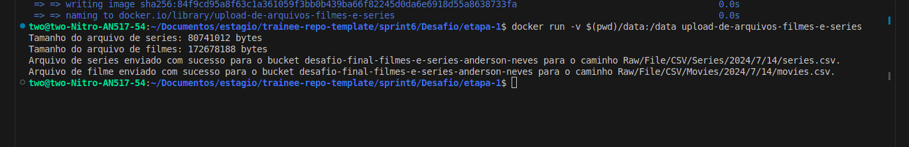
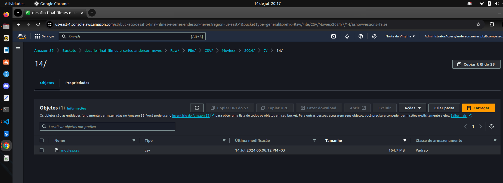

# Sobre o desafio
- O desafio dessa sprint consiste em uma primeira etapa do desafio final do program de bolsas, em que foi enviado como recursos dois aquivos .cvs sobre filmes e series, nessa primeira etapa foi solicitado que criasse um Bucket S3 no amazon como RAW ZONE para armazenar os dados .csv sem nenhum tipo de filtro, ou seja, os dados brutos. A ingestão dos dados para o bucket s3 deve ser realializada utilizando um código python com a biblioteca boto3, em que esse código deve ser rodado em um container docker em que os dados devem estar em um volume. 

# 📋 Etapas

## 1️⃣ Criação do Bucket S3

  <div style="text-align: center; padding: 10px;">
    
  </div>

## 2️⃣ Criação do código python para upload dos dados

- Após criar o bBucket S3, foi criado o código python com a sequencia a seguir:
- Importação das bibliotecas utilizadas

  ```
  import boto3
  import os
  from datetime import datetime
  from dotenv import load_dotenv
  ```
- Carregar as variaveis de ambiente no aquivo .env que tem as credenciais da conta aws. Esse arquivo está em gitignore.
  ```
  load_dotenv('/app/.env')
  ```
- Extraindo o ano, mes e dia utilizando `datetime()`
  ```
  ano = datetime.now().year
  mes = datetime.now().month
  dia = datetime.now().day
  ```
- Criando as variaveis com o caminho onde vai ser feita a ingestão dos arquivos no bucket S3.
  ```
  caminho_movies = f"Raw/File/CSV/Movies/{ano}/{mes}/{dia}/movies.csv"
  caminho_series = f"Raw/File/CSV/Series/{ano}/{mes}/{dia}/series.csv"
  ```

- Criando a variavel para como nome do Bucket S3 para o qual os arquivos brutos irão ser armazenados
  ```
  bucket_S3 = 'desafio-final-filmes-e-series-anderson-neves'
  ```
- Criando as variaveis que vão conter o local onde estão os arquivos .csv no volume do container
    ```
    caminho_arquivo_series = '/data/series.csv'
    caminho_arquivo_movies = '/data/movies.csv'
    ```
- Print para exibir o tamanho total dos arquivos em bytes que vão ser enviados utilizando o método `getsize()` a biblioteca `os`.
  ```
  print(f"Tamanho do arquivo de series: {os.path.getsize(caminho_arquivo_series)} bytes")
  print(f"Tamanho do arquivo de filmes: {os.path.getsize(caminho_arquivo_movies)} bytes")
  ```
- Criando o client da aws utilizando o `boto3` com as credenciais vindas do arquivo .env que estarão no container utilizando o método `getenv()` da biblioteca `os`. Obs.: padronizei a região.
  ```
  s3_client = boto3.client(
      's3',
      region_name='us-east-1',
      aws_access_key_id=os.getenv('AWS_ACCESS_KEY_ID'),
      aws_secret_access_key=os.getenv('AWS_SECRET_ACCESS_KEY'),
      aws_session_token=os.getenv('AWS_SESSION_TOKEN'),
  )
  ```
- Etapa para realizar o upload dos arquivos para o bucket S3 utilizando o método `upload_file()` da biblioteca `boto3` em que envio primeiramente como parametro o local onde está o meu arquivo, segundamente o nome do meu bucket e por ultimo o caminho que desejo que o arquivo seja armazenado. 
- Essa etapa está dentro de um bloco try catch para caso aja alguma exeção seja exibido o erro acontecido.
  ```
  try:
      #Upload do arquivo de series
      s3_client.upload_file(caminho_arquivo_series, bucket_S3, caminho_series)
      print(f"Arquivo de series enviado com sucesso para o bucket {bucket_S3} para o caminho {caminho_series}.")

      #Upload do arquivo de filmes
      s3_client.upload_file(caminho_arquivo_movies, bucket_S3, caminho_movies)
      print(f"Arquivo de filme enviado com sucesso para o bucket {bucket_S3} para o caminho {caminho_movies}.")
  except Exception as UploadError:
      print(f"Erro ao enviar o arquivo: {UploadError}")
  ```
- Código completo:
  ```
  import boto3
  import os
  from datetime import datetime
  from dotenv import load_dotenv

  # Importando o arquivo .env que tem as variáveis de ambiente com os dados de login root
  load_dotenv('/app/.env')

  # Pegando o ano, mes e dia do dia do upload com datetime().now
  ano = datetime.now().year
  mes = datetime.now().month
  dia = datetime.now().day

  #Criando as variveis com o caminho onde vai ficar os arquivos
  caminho_movies = f"Raw/File/CSV/Movies/{ano}/{mes}/{dia}/movies.csv"
  caminho_series = f"Raw/File/CSV/Series/{ano}/{mes}/{dia}/series.csv"

  #Nome do bucket 
  bucket_S3 = 'desafio-final-filmes-e-series-anderson-neves'
  #caminho dos arquivos no volume do container que vão fazer upload 
  caminho_arquivo_series = '/data/series.csv'
  caminho_arquivo_movies = '/data/movies.csv'

  print(f"Tamanho do arquivo de series: {os.path.getsize(caminho_arquivo_series)} bytes")
  print(f"Tamanho do arquivo de filmes: {os.path.getsize(caminho_arquivo_movies)} bytes")

  #Criando o client da aws utilizando o boto3 com as credencias vindas do arquivo .env que está no container
  s3_client = boto3.client(
      's3',
      region_name='us-east-1',
      aws_access_key_id=os.getenv('AWS_ACCESS_KEY_ID'),
      aws_secret_access_key=os.getenv('AWS_SECRET_ACCESS_KEY'),
      aws_session_token=os.getenv('AWS_SESSION_TOKEN'),
  )

  try:
      #Upload do arquivo de series
      s3_client.upload_file(caminho_arquivo_series, bucket_S3, caminho_series)
      print(f"Arquivo de series enviado com sucesso para o bucket {bucket_S3} para o caminho {caminho_series}.")

      #Upload do arquivo de filmes
      s3_client.upload_file(caminho_arquivo_movies, bucket_S3, caminho_movies)
      print(f"Arquivo de filme enviado com sucesso para o bucket {bucket_S3} para o caminho {caminho_movies}.")
  except Exception as UploadError:
      print(f"Erro ao enviar o arquivo: {UploadError}")
  ```
## 3️⃣ Criação do arquivo Dockerfile

- Após criar o código em python, foi criado o arquivo Dockerfile para criar um imagem para rodar o código de upload
- A imagem base que o container vai usar o python na versão 3.9 (mais recente)
  ```
  FROM python:3.9
  ```
- Instalação das bibliotecas boto3 e python-dotenv que são necessárias para rodar o código python criado
  ```
  RUN pip install boto3 
  RUN pip install python-dotenv
  ```
- Criando o ambiente de trabalho no container
  ```
  WORKDIR /app
  ```
- Fazendo a cópia do arquivo python index.py e .env para dentro do ambiente de trabalho /app no container
  ```
  COPY index.py /app/index.py
  COPY .env /app/.env
  ```
- Definindo o comando a ser executado quando o container for executado que nesse caso será rodado o script em python `index.py`
  ```
  CMD ["python", "index.py"]
  ```

- Código Dockfile completo:
  ```
  # Comando para criar uma imagem base python versão 3.9 (a mais atual)
  FROM python:3.9

  # Instalando boto3 e o dotenv
  RUN pip install boto3 
  RUN pip install python-dotenv

  # Criando o diretório de trabalho no container onde vão ficar os dados
  WORKDIR /app

  # Copiando oscript Python que faz o uload dos arquivos e o arquivo .env com as variáveis de ambiente para o diretório de trabalho
  COPY index.py /app/index.py
  COPY .env /app/.env

  # Executando o código python para fazer upload dos arquivos no container
  CMD ["python", "index.py"]
  ```

  
## 4️⃣ Criando a imagem do container
- Foi executado o comando docker abaixo no terminal localmente para criação da imagem do arquivo Dockerfile:
  ```
  docker build -t upload-de-arquivos-filmes-e-series .
  ```
    -`docker build`: cria a imagem apartir do arquivo Dockfile;
    -`-t upload-de-arquivos-filmes-e-series`: definindo o nome da imagem;
    -`.`: Local onde está o Dockfile que nesse caso está no mesmo diretório.
- Resultado: 
<div style="text-align: center; padding: 10px;">
  
</div>


## 5️⃣ Criando o container e rodando
- Para a criação e iniciação de um container para a imagem retratada no tópico acima foi executado o seguinte comando: 
  ```
  docker run -v $(pwd)/data:/data upload-de-arquivos-filmes-e-series
  ```
  - `docker run`: roda o container;
  - `-v`: cria um volume;
  - `$(pwd)/data`: retona o diretório atual em que o diretório /data está, em que esse diretório contém os arquivos .csv que vão ser realizados a ingestão;
  - `:/data`: Diretório dentro do container que vão ter os dados dos arquivos .csv;
  - `upload-de-arquivos-filmes-e-series`: Imagem criada acima para rodar no container.
- Executando o comando:
<div style="text-align: center; padding: 10px;">
  
</div>

## 6️⃣ Evidencias dos arquivos no Bucket s3
- Filmes:
<div style="text-align: center; padding: 10px;">
  
</div>
- Séries:
<div style="text-align: center; padding: 10px;">
  
</div>

## 7️⃣ Referências 

- [Documentação da biblioteca dotenv](https://pypi.org/project/python-dotenv/)

- [Documentação da função upload_file](https://boto3.amazonaws.com/v1/documentation/api/latest/reference/services/s3/client/upload_file.html)

